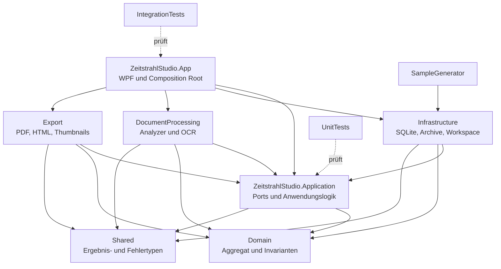
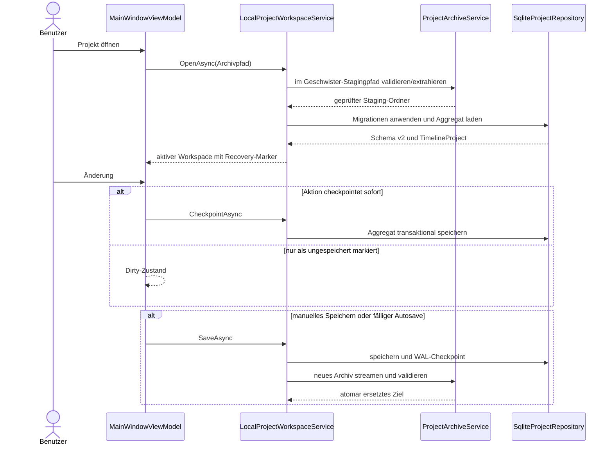
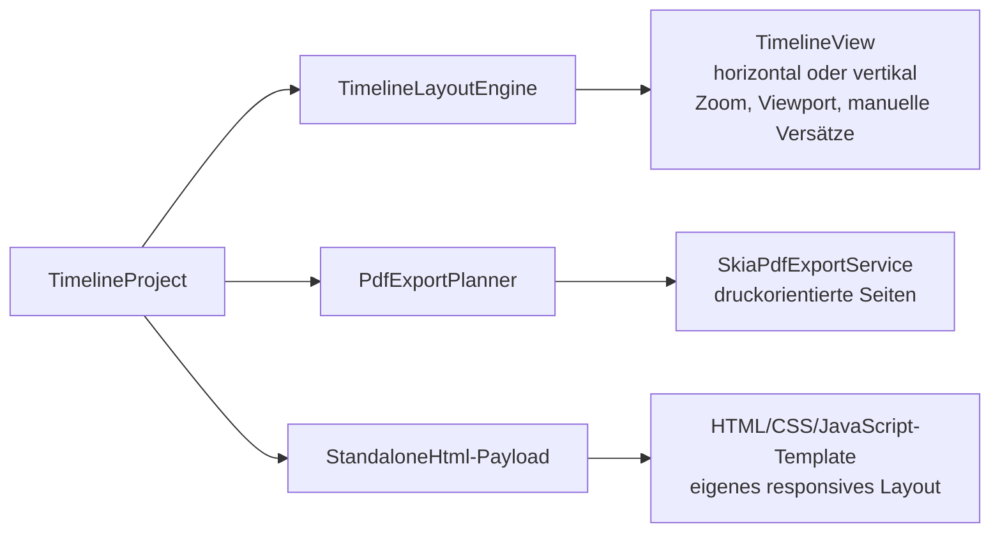

# Architektur von Zeitstrahl Studio

Diese Dokumentation beschreibt den implementierten Stand von Version 1.1.0. Normative Ziele stehen in [`SPEC.md`](SPEC.md); der aktuelle Produkt- und QA-Status steht in [`STATUS.md`](STATUS.md).

## Kontext und Qualitätsziele

Zeitstrahl Studio ist eine lokale deutschsprachige Einzelbenutzer-Desktopanwendung für Windows 10 und 11 x64. Sie basiert auf .NET 8, WPF und C# 12. Zentrale Qualitätsziele sind:

- fachlich unverfälschte Datumsgenauigkeiten und transaktionale Projektzustände
- vollständige lokale Verarbeitung ohne Cloud, Telemetrie oder externe KI
- sicherer Transport in atomar geschriebenen, validierten `.zeitprojekt`-Archiven
- robuste Verarbeitung großer Dateien und mehrerer Tausend Ereignisse mit Streaming, Limits, Virtualisierung und asynchronen Abläufen
- testbare Fach- und Layoutlogik hinter Ports, mit WPF als äußerem Adapter
- nachvollziehbare lokale Änderungen durch Audit, Sicherungen und Recovery

SHA-256 schützt dabei die Integrität, nicht die Herkunft. Projektarchive und Exporte sind weder signiert noch verschlüsselt.

## Solution und Abhängigkeiten

Die Solution enthält zehn Projekte: sieben Produktionsprojekte, zwei Testprojekte und den SampleGenerator.

| Projekt | Verantwortung | Direkte interne Abhängigkeiten |
| --- | --- | --- |
| `ZeitstrahlStudio.Domain` | Aggregat, Value Objects, Invarianten | keine |
| `ZeitstrahlStudio.Shared` | kleine gemeinsame Ergebnis-/Fehlertypen | keine |
| `ZeitstrahlStudio.Application` | Ports, Anwendungsmodelle, Editing- und Layoutlogik | Domain, Shared |
| `ZeitstrahlStudio.Infrastructure` | SQLite, Archive, Workspaces, Backups, Recovery, Recent Projects, Logs | Application, Domain, Shared |
| `ZeitstrahlStudio.DocumentProcessing` | PDF-, Bild-, DOCX-, XLSX-Analyse und Windows-OCR | Application, Domain, Shared |
| `ZeitstrahlStudio.Export` | PDF-, HTML- und Thumbnail-Erzeugung | Application, Domain, Shared |
| `ZeitstrahlStudio.App` | WPF, MVVM, Dialoge, Composition Root | Application und alle drei Adapterprojekte |
| `ZeitstrahlStudio.UnitTests` | schnelle Fach-, Planner- und Layouttests | Application, Domain, Export, Shared |
| `ZeitstrahlStudio.IntegrationTests` | reale SQLite-, Archiv-, Dokument-, Export- und WPF-Tests | App und alle fachlichen/technischen Projekte, SampleGenerator |
| `ZeitstrahlStudio.SampleGenerator` | reproduzierbare frei erfundene Beispieldaten | Application, Domain, Infrastructure, DocumentProcessing, Export |

Die Pfeile zeigen reale Projektverweise. Domain und Shared sind unabhängig; äußere Adapter implementieren Ports aus Application. Geschäftsregeln gehören nicht in WPF-Code-behind.

## Start und Composition Root

`App.xaml.cs` baut beim Start einen validierten `Microsoft.Extensions.DependencyInjection`-Container auf. Registriert werden die konkreten Infrastruktur-, Analyse- und Exportadapter sowie Editing-Service, Theme-Service, Dialogdienst, `MainWindowViewModel` und `MainWindow`. Die Dienste sind für den lokalen Einzelprozess überwiegend als Singletons verdrahtet; zustandsbehaftete Dienste serialisieren ihre eigenen kritischen Operationen.

Der Startablauf ist:

1. DI-Container bauen und Registrierungen validieren.
2. globales Theme aus `%LocalAppData%\Zeitstrahl Studio\appearance-settings.json` initialisieren.
3. Hauptfenster und ViewModel erzeugen, Dispatcherfehlerbehandlung einhängen und Fenster anzeigen.
4. ViewModel initialisieren: Recent Projects und Recovery-Kandidaten laden sowie den festen 60-Sekunden-Autosave starten.
5. Optional den ersten Kommandozeilenparameter mit Endung `.zeitprojekt` nach der Initialisierung öffnen; dadurch funktioniert die Dateizuordnung.
6. Beim Beenden ViewModel und Container geordnet freigeben.

Nicht abgefangene Dispatcherfehler werden in das lokale technische JSONL-Protokoll geschrieben und als deutsche Fehlermeldung angezeigt. Erwartbare Datei-, Validierungs- und Integritätsfehler werden möglichst an der Anwendungsgrenze in verständliche Ergebnisse beziehungsweise Dialogmeldungen übersetzt.

## Domain und Anwendungsschicht

`TimelineProject` ist die Aggregatwurzel. Es enthält Projektmetadaten, `ProjectSettings`, `TimelineEvent`-Objekte und `LayoutPosition`-Werte. Ein Ereignis enthält Texte, eine `EventDate`, Priorität, Status, Farbe, Tags, HTTP(S)-Links, Anhänge und optional eine unabhängige Frist.

`EventDate` bewahrt die Eingabegenauigkeit `Year`, `MonthAndYear`, `ExactDate`, `ExactDateTime` oder `DateRange`. Fehlende Bestandteile werden nur für interne Sortierberechnungen abgeleitet, nicht als eingegebene Werte gespeichert oder angezeigt. Manuelle Reihenfolge gilt nur innerhalb einer vollständig identischen fachlichen Datumsgruppe. Visuelle Kartenversätze sind in `LayoutPosition` nach horizontaler beziehungsweise vertikaler Orientierung vom Datum getrennt.

Application definiert asynchrone Ports für Repository, Workspace/Archiv, Attachments, Analyseablage und -queue, Suche, Preview/Thumbnail, PDF, HTML, Backups, Audit, Recent Projects, Recovery, Autosave und lokale technische Logs. `ProjectEventEditingService` ersetzt validierte Ereignisfassungen atomar und führt je Projekt eine sitzungsgebundene Undo-/Redo-Historie von höchstens 100 Einträgen. Die Historie wird beim Schließen gelöscht und ist kein Persistenzmechanismus.

## SQLite-Persistenz

`SqliteProjectRepository` arbeitet auf `project.db`. Jede Verbindung aktiviert Fremdschlüssel, WAL, einen begrenzten Busy-Timeout und den vorgesehenen Synchronitätsmodus. Zusammengehörige Änderungen und Migrationen laufen in Transaktionen. Unbekannte neuere Schema-Versionen werden abgelehnt.

Das aktuelle Datenbankschema ist Version 2:

- Migration 1 erstellt `Projects`, `Events`, `EventDates`, `Deadlines`, `Attachments`, `AttachmentMetadata`, `ExtractedTexts`, `WebLinks`, `Tags`, `EventTags`, `LayoutPositions`, `ProjectSettings`, `AuditLog`, `ApplicationLogReferences`, `Backups` und den FTS5-Index `SearchIndex`; `SchemaMigrations` protokolliert die ausgeführten Schritte.
- Migration 2 erstellt `DocumentSearchIndex` und übernimmt vorhandene extrahierte Texte. Dieser FTS5-Index ist für Dokumenttext maßgeblich. `SearchIndex` bleibt als Legacy-Projekt-/Ereignisindex erhalten.

`ProjectSettings` besitzt typisierte Spalten, unter anderem für Orientierung, Theme, Farben, Schriftgrößen, Lückenkompression, Autosave- und Backupwerte; es ist kein JSON-Blob. `ApplicationLogReferences` existiert im Schema, wird im aktuellen UI-/Logpfad aber nicht produktiv genutzt. Auditdaten liegen in SQLite, technische Anwendungslogs außerhalb des Projekts.

## Archiv- und Workspace-Lebenszyklus

Eine `.zeitprojekt`-Datei wird nie direkt bearbeitet. Das Archivformat steht in [`PROJECT_FORMAT.md`](PROJECT_FORMAT.md).

Der Import verwendet den Geschwisterpfad `<Zielworkspace>.importing-<GUID>` als Stagingziel.

Verwaltete Laufzeitdaten liegen unter `%LocalAppData%\Zeitstrahl Studio`:

| Pfad | Zweck |
| --- | --- |
| `Workspaces` | extrahierte aktive Arbeitskopien und Recovery-Marker |
| `Backups` | geprüfte lokale Projektsicherungen |
| `Logs` | technische rotierende JSONL-Protokolle |
| `application-state.json` | zuletzt verwendete Projektpfade |
| `appearance-settings.json` | globales Farbschema |

Die Archivdatei selbst liegt am vom Benutzer gewählten Ort. Export lädt zuerst das Projekt, checkpointet WAL und sammelt die zulässigen Quellen. Danach schreibt und hasht `WriteArchiveAsync` das temporäre ZIP. Erst anschließend prüft `ValidateReferencedAttachments` die referenzierten Attachments gegen Projektmetadaten und erzeugte Manifestdateiliste. `VerifyArchiveAsync` validiert das geschlossene ZIP danach auf Struktur, Manifest, Pfade, Längen und Dateihashes, ohne die DB↔Attachment-Querverifikation zu wiederholen. Nur nach beiden Prüfungen wird das Ziel atomar ersetzt. Es gibt kein Save-Journal; Robustheit entsteht aus SQLite-Transaktionen/WAL, Staging, Dateiprüfung und atomarem Dateiersatz.

## Attachments und Dokumentverarbeitung

Der Import kopiert jede Quelldatei streamend unter einen GUID-basierten kollisionsfreien Projektpfad. Währenddessen entsteht SHA-256; anschließend werden Quellgröße und Schreibzeit erneut geprüft. Teilerfolge eines Mehrfachimports bleiben erhalten, unvollständige Zielkopien werden bestmöglich entfernt. Die Anhangsmetadaten enthalten auch den ursprünglichen absoluten Quellpfad.

Preview, explizites Öffnen und Dokumentpaket-/Archivexport verwenden den zentralen `AttachmentFileService`: Er prüft Workspace-Grenze, Reparse Points, Existenz, Länge, Schreibstabilität und SHA-256. Doppelklick blockiert zusätzlich riskante Erweiterungen; die bewusste Öffnen-Aktion kann eine validierte Datei dennoch per Shell an das Windows-Standardprogramm übergeben.

Die begrenzte Analysequeue verarbeitet höchstens zwei Jobs parallel. Windows-OCR wird innerhalb des OCR-Dienstes serialisiert. Analyzer sind vollständig lokal:

- PDF: eingebetteter Text und bei Bedarf OCR gerenderter Seiten; OCR-Sicherheitslimit 250 Seiten
- PNG/JPEG/TIFF/BMP: deutsche Windows-OCR
- DOCX/XLSX: begrenzte ZIP-/XML-Reader ohne Office-Automation, DTD oder externe Resolver

Analyzer begrenzen unter anderem Archivgrößen, Einträge, Textmenge, Kompressionsverhältnis und Datumsfundstellen. Ergebnisse werden transaktional in `ExtractedTexts` und `AttachmentMetadata` gespeichert; `DocumentSearchIndex` wird im selben Ablauf aktualisiert. Die UI zeigt Text, Metadaten und Datumsfundstellen schreibgeschützt an; eine Übernahme in Ereignisfelder ist nicht implementiert.

## Autosave, Recovery, Sicherungen und Logs

Der UI-Host startet Autosave fest alle 60 Sekunden. Das persistierte Feld `AutoSaveIntervalSeconds` wird von diesem Startpfad nicht ausgewertet und ist nicht in der UI konfigurierbar. Einige Änderungen rufen sofort `CheckpointAsync` auf, andere setzen nur den Dirty-Zustand; manuelles Speichern beziehungsweise der nächste Autosave bringt den Stand in Workspace und Archiv. Speichervorgänge werden serialisiert.

Jeder aktive Workspace erhält `metadata/session.json`. Dieser Marker enthält Projekt-/Prozessbezug, wird nicht exportiert und ermöglicht die Erkennung verwaister Arbeitskopien; Workspaces aktiver Prozesse werden ausgeschlossen.

Automatische Backups werden bei Speichervorgängen nach Fälligkeit erzeugt. Standardretention: 6 aktuelle, 7 tägliche und 8 wöchentliche Sicherungen; manuelle Sicherungen werden nie automatisch rotiert. Restore validiert die Sicherung, erzeugt zuerst eine manuelle Sicherheitssicherung des Ausgangsstands und liefert einen zu speichernden Workspace.

Das fachliche Audit liegt in `AuditLog` der Projektdatenbank und ist über `Werkzeuge > Protokoll` lesbar. Technische Fehlerlogs liegen als `application.log.jsonl` mit Rotation unter `Logs` (standardmäßig fünf Dateien zu etwa 5 MiB). Für technische Logs existiert in der WPF-Oberfläche keine Anzeige-, Export- oder Löschfunktion.

## Drei getrennte Darstellungswege

WPF, PDF und HTML nutzen dieselben Fachdaten, aber keine gemeinsame räumliche Layoutprojektion.

Die WPF-Engine berechnet interaktive Karten, Achse, Lücken und Kollisionsabstände. PDF plant A4/A3/Letter/benutzerdefinierte Seiten, Mehrseiten-, Großseiten- oder Zeitraumexport und rendert über Skia. PDF enthält Texte, Dokumentnamen und gegebenenfalls eine primäre validierte Miniatur, aber keine anklickbar eingebetteten Anlagen. HTML serialisiert einen sicheren Payload in ein CSP-geschütztes Offline-Template; optional verpackt ein ZIP validierte Dokumentkopien. HTML-Links verlangen vor externen Zielen eine Bestätigung. Beide Exporte besitzen eigene Layouts und reproduzieren WPF-Positionen, Zoom oder Gap-Kompression nicht exakt.

## Sicherheits- und Vertrauensgrenzen

- Archivimport begrenzt Dateizahl, Manifest, Einzel-/Gesamtgröße, freien Speicher und extreme Kompression; Pfade werden normalisiert, Traversal, reservierte Namen und Reparse Points werden abgewehrt.
- Export folgt nur verwalteten Wurzeln, lehnt Reparse Points ab und übernimmt ein Ziel erst nach vollständiger Revalidierung.
- SHA-256 im selben Archiv erkennt zufällige oder nachträgliche Änderungen, beweist aber weder Autor noch Vertrauenswürdigkeit.
- Archive, Backups, PDF und HTML sind nicht verschlüsselt oder passwortgeschützt. Der absolute ursprüngliche Attachment-Quellpfad ist Projektmetadatum und kann personenbezogene Ordnernamen enthalten.
- Das bewusste Öffnen übergibt validierte Dateien an externe Windows-Programme; deren Verhalten liegt außerhalb des Prozesses. Entsprechendes gilt für Browser und externe HTTP(S)-Links.
- Technische Logs können Pfade und Fehlerdetails enthalten und sind vor Weitergabe als sensibel zu behandeln.

Weitere Datenschutzfolgen beschreibt [`PRIVACY.md`](PRIVACY.md).

## Belegte technische Grenzen und Risiken

- Es gibt keinen projektinternen Papierkorb und keine Orphan-Bereinigung für physische Attachmentdateien. Entfernte oder mit einem Ereignis gelöschte Kopien können für Undo bestehen bleiben und später weiterhin archiviert werden; Archivverkleinerung ist nicht garantiert.
- Vor dem Duplizieren sollte manuell gespeichert werden. Die Kopie erhält eine neue Projekt-ID und wird aktiv; nur im Speicher befindlicher Zustand kann fehlen.
- Autosave ist im UI-Host fest auf 60 Sekunden eingestellt, obwohl das Schema ein Intervallfeld besitzt.
- Projektuntertitel, Beschreibung und übergreifende Projektdaten besitzen nach dem Erstellen keine Bearbeitungsoberfläche.
- Code-Inferenz: Der Analysepfad vertraut stärker auf den bei Import/Workspace festgelegten Dateipfad als Preview, Öffnen und Export, die den zentralen vollständigen Pfad-/Reparse-/Hash-Check verwenden. Diese Asymmetrie sollte bei Änderungen am Analysepfad geschlossen oder bewusst getestet werden.
- Der Archivimport prüft Dateien gegen das Manifest sowie Datenbank/Projekt-ID/-Name, führt aber keine zusätzliche DB↔Attachment-Längen-/Hash-Querverifikation aus. Der nächste Export/Save schreibt zunächst ein temporäres ZIP und führt diese Querverifikation danach vor der atomaren Übernahme aus; eine Abweichung verhindert die Übernahme.
- Ein bereits laufender einzelner nativer PDFium-Aufruf ist nicht hart abbrechbar; Cancellation wirkt an den verwalteten Grenzen davor und danach.
- Die aktuellen bestätigten UI-Fehler stehen in [`TROUBLESHOOTING.md`](TROUBLESHOOTING.md).

## Wartung und Erweiterung

Bei neuen Fähigkeiten gilt:

1. Fachliche Invarianten in Domain ergänzen und mit Unit-Tests absichern.
2. Anwendungsfall und Port in Application definieren; Editing-Historie und Auditwirkung bewusst festlegen.
3. Adapter in Infrastructure, DocumentProcessing oder Export implementieren und in `App.xaml.cs` registrieren.
4. WPF bindet den Port über ViewModel/Command; Code-behind bleibt auf View-Interaktion beschränkt.
5. Reale Dateisystem-, SQLite-, Archiv-, Dokument- und UI-Grenzen in IntegrationTests prüfen.

Besonders zu bewahrende Invarianten sind: Datumsgenauigkeit nicht erfinden, `.zeitprojekt` nie direkt bearbeiten, gültiges Ziel bei Fehlern erhalten, Projektdateien nur unter verwalteten Wurzeln adressieren, Attachmentgröße und -SHA vor Transfer prüfen, keine Netzwerkabhängigkeit einführen, Exportlayouts nicht als WPF-Pixelkopie behandeln und bestehende Sampledateien nur über den dafür vorgesehenen Generator verändern.

Build- und Testbefehle stehen in [`BUILD.md`](BUILD.md).
